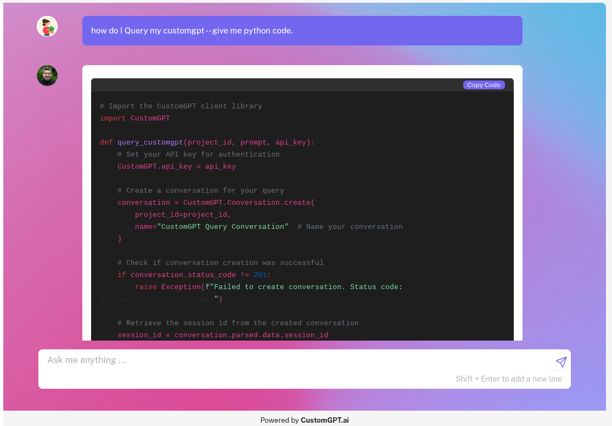

# GitHub Repository Sitemap Generator

Generate sitemaps from GitHub repositories to train custom AI chatbots. This tool helps you create AI assistants that can answer questions about your codebase and documentation.

[](https://github2customgpt.streamlit.app)

## 🚀 Features

- Generate sitemaps from any public GitHub repository
- Support for various GitHub URL formats (HTTPS, SSH, specific branches)
- Easy integration with CustomGPT.ai for creating AI chatbots using no-code. 
- Clean, user-friendly interface.
- Support for repositories up to 50,000 files
- Real-time validation and error handling
- Automatic sitemap generation and hosting

## 🎯 Use Cases

- Create AI documentation assistants for your projects
- Build code-aware chatbots for developer support
- Generate knowledge bases from GitHub wikis and docs
- Build RAG models on your repository's content
- Make your codebase more accessible through natural language

## 🏃‍♂️ Quick Start

### Using the Live App

1. Visit [GitHub Sitemap Generator](https://github2customgpt.streamlit.app)
2. Enter your GitHub repository URL, Click "Generate Sitemap" and Copy the generated sitemap URL.
3. Use the Sitemap URL in [CustomGPT.ai](https://customgpt.ai) to create your coding assistant chatbot.

### Running Locally

#### Using Docker (Recommended)

```bash
git clone git@github.com:adorosario/github2customgpt.git
cd github2customgpt
docker-compose up --build
```

Visit `http://localhost:8501` in your browser.

#### Manual Setup

1. Clone the repository:
   ```bash
   git clone github2customgpt
   cd github-sitemap-generator
   ```

2. Install dependencies:
   ```bash
   pip install -r requirements.txt
   ```

3. Configure AWS credentials in `.streamlit/config.toml`:
   ```toml
   [aws_s3]
   accountid = "your-account-id"
   access_key_id = "your-access-key"
   access_key_secret = "your-secret-key"
   ```

4. Run the application:
   ```bash
   streamlit run github_sitemap_generator.py
   ```

## 📝 Usage Tips

1. **Repository Selection**:
   - Choose repositories with good documentation
   - Include README files, wikis, and inline comments
   - Markdown files work best for training

2. **URL Formats**:
   - Main branch: `https://github.com/username/repository`
   - Specific branch: `https://github.com/username/repository/tree/branch-name`
   - SSH format: `git@github.com:username/repository.git`

3. **Best Practices**:
   - Start with smaller public repositories for quicker testing
   - Focus on well-documented code sections
   - Include documentation directories
   - Ensure repository is public

## ⚠️ Limitations

- Only works with public GitHub repositories
- Maximum 50,000 files per repository
- Some file types may not be suitable for AI training (e.g images)
- Repository must be accessible via GitHub API
- Private repositories are not supported

## 🤝 Contributing

Contributions are welcome! Please feel free to submit a Pull Request.

1. Fork the repository
2. Create your feature branch (`git checkout -b feature/AmazingFeature`)
3. Commit your changes (`git commit -m 'Add some AmazingFeature'`)
4. Push to the branch (`git push origin feature/AmazingFeature`)
5. Open a Pull Request

## 📄 License

This project is licensed under the MIT License - see the [LICENSE](LICENSE) file for details.

## 🙏 Acknowledgments

- Built with [Streamlit](https://streamlit.io)
- Powered by [CustomGPT](https://customgpt.ai)
- Uses [GitHub API](https://docs.github.com/en/rest)

## 📞 Support

If you encounter any issues or have questions, open an issue in this repository
